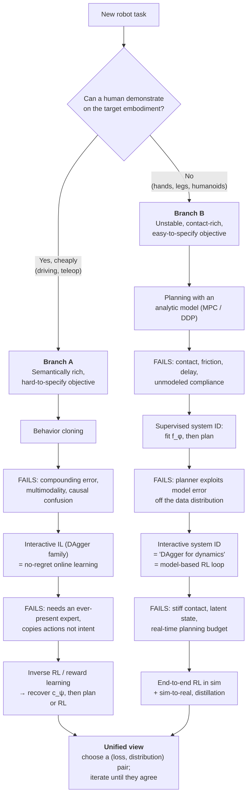

# Principled Robot Learning: A Deployment Perspective

> **Status:** draft notes for book integration. Sections 1–2 are polished prose. Sections 3–6 are structured rough notes (branch skeletons, intuition, notation) intended to be expanded into chapters. No proofs here — theorem statements are flagged as `[LATER: ...]` hooks.

---

## 1. Why Robot Learning

Building a robot that works is an act of interdisciplinary bookkeeping. To move a physical system through the world with intent, an engineer has to simultaneously:

- **model** the system — rigid-body dynamics, actuator and transmission behavior, contact, friction, compliance, latency;
- **control** it — stabilize it, respect constraints, and do so with guarantees that survive contact with reality;
- **perceive** the scene — recover the geometry and, increasingly, the *semantics* that determine what an action means (a plastic bag and a child are the same number of pixels);
- **specify the objective** — encode, as a cost or a constraint or a rule, what the engineers and the end users actually wanted.

Each of these is a field. The classical response is to make each of them a module and compose them: **perception → state estimation → planning → control**. This is good engineering. It is testable, interpretable, and it is how most robots that currently earn money are built. We should be honest about why it works before we explain why it breaks.

### 1.1 Where engineered pipelines break

The failure mode of the classical stack is not usually a failure of any module. It is a failure *at the seams*.

- **Non-differentiable, lossy interfaces.** The perception module hands the planner an object list, an occupancy grid, a cost map. That interface was designed by a human, and it throws away exactly the information the human did not anticipate needing. There is no gradient from task failure back to the representation that caused it, so the representation never learns that it was the problem.
- **Proxy objectives per module.** Detection mAP, tracking MOTA, localization RMSE. Each module is optimized against a metric that is a *proxy* for downstream task success, and the correlation between the proxy and the outcome is weak precisely in the tail cases that matter.
- **Credit assignment by human.** When the robot fails, a person has to decide which module was at fault. This is the real cost of modularity, and it scales linearly with the number of failure modes — which is to say, badly.
- **The tuning burden.** Cost function weights, gains, thresholds, hysteresis, hand-written rules for the fifteen situations someone remembered. This is a manual descent on a loss surface nobody wrote down.

None of this argues for replacing the stack with one large network. It argues for something narrower: **the parts of the stack that are hard to write down should be learned, and the interfaces around them should be differentiable or at least closed-loop-corrigible.** Which parts are hard to write down is a property of the *system*, not a matter of taste. That observation is the organizing principle of this course.

### 1.2 The design variable is the human interface

Here is the reframing we want the reader to leave Chapter 1 with.

Learning does not remove the need for human knowledge. It changes **the channel through which humans supply it**. And the cheapest, highest-bandwidth channel is different for different robots:

| System | Cheapest human channel | Why |
| --- | --- | --- |
| Self-driving car (on-road, off-road) | **Demonstration by doing** | Humans already drive. Data is collected on the true embodiment, in the true observation distribution, at scale, essentially as a byproduct of operation. |
| Table-top / mobile manipulator | **Demonstration by showing** | Teleoperating a 7-DoF arm through a contact-rich task is awkward and slow; the human would rather just *do the task* (kinesthetic teaching, handheld gripper, video). Cheap, but now there is an embodiment gap. |
| Dexterous hand, legged robot, humanoid | **Simulator + reward** | The human cannot demonstrate: there is no correspondence between a human hand and a 16-DoF tendon-driven hand, and the stabilization timescale (~ms) is below human bandwidth. But the *objective* is easy to write: track this velocity, don't fall, get the object to this pose. |

Read the table the other way and two questions fall out, and they are the only two questions that matter for choosing an algorithm:

1. **How hard is it to specify the objective?** ("What is good driving?" is hard. "Don't fall over" is easy.)
2. **How hard is it to model the system, and can a human demonstrate on the right embodiment?** (A car at 30 km/h is a bicycle model. A hand rolling a cube is not anything.)

$$
\text{cheap demos} + \text{hard objective} \;\Longrightarrow\; \text{imitation, then inverse RL}
$$
$$
\text{no demos} + \text{easy objective} + \text{hard dynamics} \;\Longrightarrow\; \text{models and planning, then RL}
$$

The rest of the course walks both implications, and shows that the *same* underlying failure — a mismatch between the distribution you trained on and the distribution your own policy induces — shows up on both paths and is fixed by the same principle.

### 1.3 What this course does differently

We take a **deployment-first** view. Each chapter starts from a thing that breaks in the field, then reaches for the concept that explains it. The concepts come from machine learning, **online learning**, reinforcement learning, and control theory, and we treat them as one framework rather than four literatures:

- **statistical learning** gives us generalization on a fixed distribution;
- **online learning** gives us the right language for the fact that in robotics the distribution is *chosen by the learner*, and gives us no-regret as the design target;
- **reinforcement learning** gives us the objective when there is no supervisor;
- **control theory** gives us stability, constraint satisfaction, and the models we should not throw away.

The intended takeaway is not a list of algorithms. It is the ability to look at a new robot, answer the two questions in §1.2, and predict which algorithm class is appropriate and — more usefully — *which failure mode you have just bought*.

---

## 2. Notation and Problem Setup

Consistent notation across both branches; control-theoretic symbols, since half our audience comes from there.

### 2.1 Objects

| Symbol | Meaning |
| --- | --- |
| $x_t \in \mathcal{X}$ | state at time $t$ |
| $o_t \in \mathcal{O}$ | observation, $o_t = h(x_t, e_t)$, sensor noise $e_t$ |
| $u_t \in \mathcal{U}$ | action / control input |
| $f$ | true dynamics, $x_{t+1} = f(x_t, u_t, w_t)$, or stochastically $x_{t+1} \sim P(\cdot \mid x_t, u_t)$ |
| $f_\phi$ | *learned* dynamics model, parameters $\phi$ |
| $\pi_\theta$ | policy, $u_t = \pi_\theta(o_t)$ or $u_t \sim \pi_\theta(\cdot \mid o_t)$; may condition on history $\tau_{:t}$ |
| $c(x,u)$ / $r(x,u)$ | cost / reward; $c_\psi$ denotes a *learned* cost, parameters $\psi$ |
| $T$, $\gamma$ | horizon, discount |
| $\pi^\star$ | expert / demonstrator policy |
| $\mathcal{D}$ | dataset, $\{(o_i, u_i)\}$ for imitation, $\{(x_i,u_i,x_i')\}$ for system ID |

**The one piece of notation that carries the whole course.** Let $d^\pi_t$ be the distribution over states at time $t$ induced by rolling out $\pi$ from the initial-state distribution, and

$$
d^\pi \;=\; \frac{1}{T}\sum_{t=0}^{T-1} d^\pi_t
$$

the (average) state-visitation distribution, a.k.a. occupancy measure. The performance of a policy is

$$
J(\pi) \;=\; \mathbb{E}_{x_0}\Big[\textstyle\sum_{t=0}^{T-1} \gamma^t\, c(x_t, \pi(x_t))\Big] \;=\; T \cdot \mathbb{E}_{x \sim d^\pi}\big[c(x, \pi(x))\big].
$$

Every method in this course is a choice of **(loss, distribution)** pair. The pathologies all come from evaluating a loss under one distribution and then deploying under another.

### 2.2 The three templates

**(a) Imitation / behavior cloning.** Supervised learning with a surrogate loss $\ell$ (NLL, MSE, or a discretized cross-entropy):

$$
\hat\theta \;=\; \arg\min_\theta\; \mathbb{E}_{x \sim d^{\pi^\star}}\big[\ell\big(\pi_\theta(x),\, \pi^\star(x)\big)\big].
$$

Note the subscript: the expectation is under the **expert's** distribution, but at test time the learner induces $d^{\pi_\theta}$. That gap is the entire chapter.

**(b) Model learning (system identification) + planning.** Fit the model on data from some behavior/exploration policy $\pi_0$:

$$
\hat\phi \;=\; \arg\min_\phi\; \mathbb{E}_{(x,u,x') \sim d^{\pi_0}}\big[\,\|f_\phi(x,u) - x'\|^2\,\big],
$$

then plan against it, e.g. receding-horizon (MPC):

$$
u_{t:t+H}^\star \;=\; \arg\min_{u_{t:t+H}} \sum_{k=t}^{t+H} c(\hat x_k, u_k) \quad \text{s.t. } \hat x_{k+1} = f_{\hat\phi}(\hat x_k, u_k),\; \hat x_t = x_t .
$$

Same structural bug: the model was fit under $d^{\pi_0}$, and the planner induces $d^{\pi_{\hat\phi}}$.

**(c) Reinforcement learning.** No supervisor, no model (or a model used only internally):

$$
\theta^\star \;=\; \arg\min_\theta\; J(\pi_\theta) \quad\text{with } J \text{ evaluated under } d^{\pi_\theta}.
$$

Self-consistent by construction — the loss and the distribution finally agree. That is why it is the terminus of both branches, and the price is sample complexity, exploration, and reward specification.

### 2.3 The recurring failure, stated once

**Covariate shift under closed-loop execution.** Suppose the learned policy has per-state error $\epsilon$ under the training distribution. In supervised learning, that is the whole story. In a closed loop, an error moves the system to a state that is *itself* less represented in training, which raises the error, which moves it further. Worst-case cost degradation scales like $O(\epsilon T^2)$ for one-shot cloning versus $O(\epsilon T)$ for methods that train on their own induced distribution.

`[LATER: reduction of imitation to no-regret online learning; the ε T² vs εT statements; simulation lemma & performance difference lemma as the model-based analogue.]`

The fix, in both branches, has the same shape: **make the training distribution the one your own policy/planner induces, by iterating.** Everything else is engineering detail about *who or what provides the labels* during that iteration.

---

## 3. Branching Structure

Two tracks through the same material, chosen by the two questions in §1.2. `[Book: render as a figure; mermaid below is a placeholder for the illustrator.]`

The point of the parallel structure is that **both branches hit the same wall in the same place** (a supervised fit evaluated off its own distribution), and both are rescued by the same move (interaction). We want the reader to see the second branch as familiar by the time they reach it.

---

## 4. Branch A — Semantically Rich Systems (on-road / off-road autonomy)

### 4.1 Why this branch looks the way it does

**Intuition to convey:** the vehicle is the *easy* part. A car at moderate speed is well described by a bicycle model; it is open-loop stable, the timescales are hundreds of milliseconds, and low-level control is a solved problem with decades of margin. Nothing here is hard to model.

What is hard is **semantics and objective**. The action depends on whether that blob is a pedestrian, whether the cyclist made eye contact, whether the mud ahead is passable or bottomless, whether the lane marking is a suggestion. And "good driving" resists being written down: it is a trade-off surface over safety, progress, comfort, legality, and social norms that differ by city. Meanwhile demonstrations are nearly free, on the true embodiment, in the true observation distribution.

**So:** don't learn dynamics. Learn the *map from perception to behavior*, and eventually learn the *objective*.

### 4.2 Step 1 — Behavior cloning

- The right first move, and we should say so plainly: it is stable, off-policy, reuses the entire ML toolbox, and scales with data you already have.
- Formulation: §2.2(a). Design choices worth a section — action parameterization (steering/accel vs. trajectory vs. waypoints), history conditioning, output distribution (unimodal regression vs. mixture vs. discretized vs. diffusion).
- Deployment reality: offline metrics (validation loss, displacement error) are *only weakly predictive* of closed-loop performance. Establish this early; it motivates everything after.

### 4.3 Step 2 — Where BC breaks

Four distinct failures, often conflated. Keep them separate:

1. **Compounding error / covariate shift.** The headline. Demonstrations contain no recovery behavior, because the expert never made the mistake the learner will make. Small deviation → unfamiliar state → larger deviation. `[LATER: ε T² argument.]`
2. **Multimodality.** At a fork, both left and right are expert behavior; the least-squares fit takes the average and drives into the divider. Motivates distributional action heads.
3. **Causal confusion / copycat.** With history in the input, the easiest predictor of $u_t$ is $u_{t-1}$. Training loss goes down; the policy stops responding to the world. A nice concrete demonstration that low loss ≠ competence.
4. **Long tail.** Rare events are, by construction, rare in the data, and they are exactly the ones with catastrophic cost. Data-engine framing: the bottleneck is *finding* the interesting states, not fitting them.

### 4.4 Step 3 — Interactive imitation learning (DAgger family)

- **The fix:** collect labels on the states *your policy* visits. Aggregate, refit, repeat.
- **The principle:** the iteration is exactly a reduction from imitation learning to **online convex optimization / no-regret learning**; the aggregation step is Follow-the-Regularized-Leader in disguise. This is where online learning earns its place in the course. `[LATER: no-regret → O(εT) guarantee.]`
- **Deployment reality — the part usually skipped:**
  - Labeling off-distribution states is *unnatural* for a human ("what would you have done in a situation you would never have gotten into?").
  - Rolling out an undertrained policy on a real vehicle is unsafe → the safety-gated variants (HG-DAgger, EnsembleDAgger, SafeDAgger, LazyDAgger) trade regret for intervention budget.
  - Interventions are cheap *signal* but expensive *labels*: a disengagement tells you where you were wrong without telling you what was right.

### 4.5 Step 4 — Why go further: inverse RL / reward learning

Motivate by what DAgger still cannot do:

- It clones **actions**, not **intent**. Change the vehicle, the sensor suite, the speed limit, or the traffic law and the mapping is invalid; the objective would have transferred.
- No counterfactual evaluation. With a cost $c_\psi$ you can score plans that nobody demonstrated, and you can *audit* the objective — a learned reward is an inspectable artifact in a way that a policy's weights are not.
- It requires the expert forever. A recovered objective lets you improve *beyond* the demonstrator by planning or doing RL against it.

Content: max-margin and max-entropy IRL, the adversarial/GAIL view as distribution matching over $d^\pi$ vs $d^{\pi^\star}$, and the honest caveats — reward is **ill-posed / unidentifiable** without regularization, and the inner loop is itself an RL problem, which is why the field spent a decade on making it cheap.

**Closing beat for Branch A:** BC → DAgger → IRL is not a ladder of sophistication, it is a ladder of *what you are willing to pay for*: data, expert availability, and compute, respectively.

---

## 5. Branch B — Unstable, Contact-Rich Systems (legged robots, humanoids, dexterous hands)

### 5.1 Why this branch looks the way it does

**Intuition to convey:** invert Branch A on every axis.

- **The objective is easy.** Track a commanded body velocity. Keep the base upright. Bring the object to this pose. You can write it down in a line, and it is nearly the true objective rather than a proxy.
- **Demonstrations are unavailable.** Morphology mismatch (human hand ↛ tendon-driven hand; human gait ↛ point-foot quadruped), no correspondence for the state, and — decisively — the **bandwidth argument**: these systems are open-loop *unstable* and must be stabilized on the millisecond timescale, far below human teleoperation bandwidth. A human cannot demonstrate balance.
- **The dynamics are hard.** Contact makes the dynamics *non-smooth and hybrid* (make/break events, stick–slip); friction coefficients are unknown and time-varying; actuators have backlash, transmission compliance, thermal droop; there are communication delays; and objects deform. Small model errors integrate quickly in an unstable system.

**So:** the leverage is not in the objective, it is in the **model**. This branch is the story of progressively giving up on writing the model down.

### 5.2 Step 1 — Planning with a model

- Start from the position of strength: with a good $f$, you need almost no data. Trajectory optimization / DDP-iLQR / MPC, whole-body control, and the reduced-order-model tradition (ZMP, LIP, centroidal dynamics) that walked robots before learning did.
- Establish the honest baseline: **model-based control is very strong when the model is right.** The learning story is not "planning is bad," it is "our model is wrong in a specific, characterizable way."

### 5.3 Step 2 — Supervised system identification, then plan

- Fit $f_\phi$ from logged transitions (§2.2(b)). Emphasize the practical winner: **residual / hybrid modeling** — learn the correction on top of rigid-body physics rather than the whole map, so the prior does the heavy lifting and the network only handles what the prior misses.
- **This is behavior cloning with the object swapped.** Same template: a supervised fit on data from a distribution you did not choose. Say this explicitly; it is the pedagogical payoff of the parallel structure.
- Multi-step vs. one-step prediction loss as the first hint of the problem: a model with excellent one-step error can diverge over the planning horizon $H$.

### 5.4 Step 3 — Where it breaks: the planner exploits the model

The crucial intuition, and it is worth being vivid about it:

> The optimizer is an adversary against your model's error. The model is accurate where you have data. The planner searches for the *lowest-cost* trajectory under the model, and low predicted cost is exactly what model error looks like where data is absent. The plan will find the region where the model is optimistically wrong and go there — that is what optimization *does*.

- Two compounding effects, keep them separate: **(i)** open-loop prediction error compounding over the horizon $H$; **(ii)** distribution shift, $f_\phi$ fit under $d^{\pi_0}$ but evaluated under $d^{\pi_{\phi}}$ induced by the planner.
- `[LATER: simulation lemma / performance-difference-style bound relating model error under $d^\pi$ to control performance loss — the exact mirror of the imitation bound.]`

### 5.5 Step 4 — Interactive system ID ("DAgger for dynamics")

- **The fix, structurally identical to DAgger:** alternate {fit $f_\phi$ on aggregated data} ↔ {plan with $f_\phi$, execute on the real system, aggregate the transitions you actually observed}. The requirement is not a globally accurate model; it is a model that is accurate **on the distribution its own planner induces**. Self-consistency, not fidelity.
- Note that no human is needed in the loop: **the world provides the labels.** This is why this branch scales differently from Branch A — and it is the single cleanest contrast between the two.
- This *is* model-based RL, and we should name the lineage (PILCO → PETS/probabilistic ensembles → latent-space world models) as an instance of the online-learning reduction rather than a separate field.
- Add **epistemic uncertainty** here: ensembles/GPs, and the choice of what to do with the uncertainty — pessimism for safe control, optimism for exploration. This is where the exploration–exploitation vocabulary enters.

### 5.6 Step 5 — Why end-to-end RL

Motivate by what the model-based loop still cannot do:

- **Stiff / discontinuous contact** makes long-horizon prediction unreliable no matter how much data you have; gradients through contact are ill-behaved.
- **Latent state.** Terrain friction, payload, object mass, and internal actuator state are unobservable; the "model" would need to model your own ignorance.
- **Real-time budget.** Online optimization at kHz on embedded hardware is a hard constraint. RL policies are **amortized planning**: pay the optimization cost offline, deploy a feed-forward pass.
- So: massively parallel simulation + domain randomization, teacher–student / privileged-information distillation, and sim-to-real as the central engineering discipline of this branch.
- **Deployment reality:** reward hacking and the specification-gaming loop (the reward was *easy* to write, not *safe* to write); safety filters / CBFs / shielding around the learned policy; hardware wear and reset cost as real terms in the sample-complexity budget; robustness vs. performance as an explicit dial.

**Closing beat for Branch B:** each step trades *structure* for *data*. Analytic model = all structure, no data. End-to-end RL in sim = little structure, enormous (synthetic) data. Most shipped systems sit in the middle, and knowing *where* to sit is the skill.

---

## 6. The Unified View (chapter target)

Bring it together with a single table and a single sentence.

| | Branch A: semantic | Branch B: dynamic |
| --- | --- | --- |
| Hard part | objective & semantics | dynamics & stability |
| Cheap human channel | demonstrations | reward + simulator |
| Naive supervised step | behavior cloning | system identification |
| What it fits | $\pi_\theta$ under $d^{\pi^\star}$ | $f_\phi$ under $d^{\pi_0}$ |
| How it breaks | learner drifts off expert states | planner exploits model error |
| Interactive fix | DAgger + expert labels | iterative sysID; world provides labels |
| Terminus | inverse RL → plan/RL on $c_\psi$ | end-to-end RL → sim-to-real |
| What you pay | expert availability | simulation fidelity & compute |

**The sentence:** *every method here is a choice of a loss and a distribution to evaluate it under, and every failure is those two disagreeing; interaction is how you make them agree.*

`[LATER: the theory chapter that formalizes the table — reduction to no-regret online learning, ε T² vs εT, simulation lemma, performance difference lemma, sample complexity for linear sysID / LQR as the one case where we can say everything.]`

---

## 7. Course Roadmap (skeleton — to be reconciled with the book's chapter numbering)

0. Introduction and motivation *(this document)*
1. Notation, MDPs, and the (loss, distribution) framing
2. Statistical learning and online learning primer — regret as a design target
3. Branch A.1 — behavior cloning and its four failure modes
4. Branch A.2 — interactive imitation; DAgger and its safe variants
5. Branch A.3 — inverse RL and reward learning
6. Branch B.1 — models, trajectory optimization, MPC
7. Branch B.2 — learning dynamics; residual models; model exploitation
8. Branch B.3 — iterative system ID and model-based RL; uncertainty
9. Branch B.4 — model-free RL, sim-to-real, distillation
10. Safety as a layer: filters, shields, constraints, and what learning does not give you
11. Evaluation and deployment: closed-loop metrics, data engines, monitoring, the long tail
12. Synthesis: choosing a method for a system you have never seen

---

## 8. Notes for Integration / Open Questions

- **Running examples:** pick one per branch and carry them through every chapter (proposal: off-road autonomy for A — it makes the semantic difficulty vivid in a way lane-keeping does not; a quadruped or dexterous in-hand reorientation for B).
- **Where do manipulators go?** They are the interesting middle case: demonstrations exist but with an embodiment gap, *and* contact dynamics are hard. Options: (a) a third short branch, (b) a synthesis chapter after both branches that shows the two toolkits combining. Leaning (b) — it makes a better ending than a third parallel track.
- Decide whether to use $s,a$ (RL convention) or $x,u$ (control convention) book-wide. Current draft is $x,u$; flag for consistency with existing chapters.
- Each chapter should end with a **"what breaks next"** box — it is the device that makes the branching structure feel like a narrative rather than a taxonomy.
- Every failure mode named in §4.3 and §5.4 should get a minimal reproducible demo (toy 2D car for A, cartpole/hopper with a deliberately wrong friction coefficient for B). Cheap to run, and they make the theory land before the theory arrives.
- Citations deliberately omitted from this draft; add on integration.